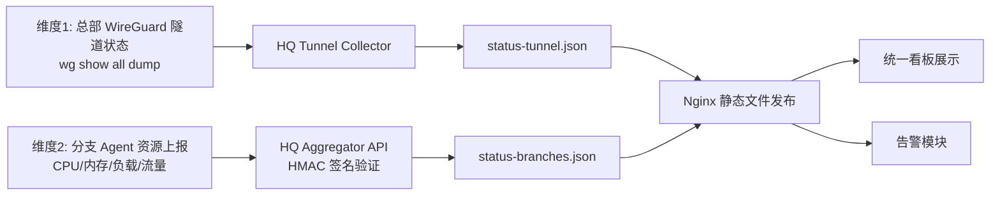

# VyOS 1.5.0 WireGuard 隧道组网与一体化监控系统方案白皮书

> **版本**: v2.1（已修正）**修订日期**: 2025-07-17

## 1. 文档目标

本文档用于指导在 VyOS 1.5.0 环境中，完成以下两项建设：

- 跨地域 WireGuard 隧道组网（星形拓扑，支持多分支，仅总部具备公网 IP）
- 本地单机一体化监控看板（不依赖外部独立监控服务器）

## 2. 适用范围与约束

### 2.1 适用场景

- 总部与多分支站点之间的 LAN 到 LAN 互联
- 分支侧无公网 IP，仅总部具备公网 IP
- 希望在 VyOS 本机完成采集、发布、展示闭环
- 分支之间可经总部中转互通

### 2.2 已知约束

- VyOS 无内置完整 Web 可视化平台
- VyOS 1.5.0 的 REST API 侧重静态配置树，不适合直接获取 WireGuard 动态状态
- 需要通过底层命令采集握手与流量等实时数据
- 前端资源必须本地化部署，不依赖外部 CDN

## 3. 网络组网方案

### 3.1 核心需求

- 打通总部与所有分支的互访路由
- 在仅一端公网的条件下维持稳定隧道
- 支持多分支扩展（3+ 节点）

### 3.2 角色分工

- 总部（有公网 IP）：监听端（Listen），开放 UDP 端口
- 分支（无公网 IP）：发起端（Initiator），主动连接并发送保活

### 3.3 网段规划（多分支）

| 节点 | 角色 | AS 号 | 隧道地址 | LAN 网段 | 说明 |
| --- | --- | --- | --- | --- | --- |
| 总部 | Listen | 65500 | 10.10.0.1/24 | 192.168.1.0/24 | 公网 IP 203.0.113.1 |
| 上海 | Initiator | 65501 | 10.10.0.11/24 | 192.168.11.0/24 | 无公网 |
| 北京 | Initiator | 65502 | 10.10.0.12/24 | 192.168.12.0/24 | 无公网 |
| 广州 | Initiator | 65503 | 10.10.0.13/24 | 192.168.13.0/24 | 无公网 |
| 成都 | Initiator | 65504 | 10.10.0.14/24 | 192.168.14.0/24 | 无公网 |

> **设计说明**：隧道网段采用 `10.10.0.0/24`（可容纳 253 个节点），所有分支共用总部单 `wg0` 接口。各分支 LAN 网段以 `192.168.(10+N).0/24` 规划，避免地址冲突。路由采用 eBGP 动态宣告（总部 AS 65500，各分支独立 AS），分支间路由经总部自动传播，无需手动维护静态路由。

## 4. VyOS 1.5.0 组网配置

> **注意**：VyOS 1.5.0 防火墙语法为 `set firewall ipv4 input filter rule ...`。

### 4.1 总部配置（有公网 IP，多 Peer）

```bash
configure

# 1) WireGuard 接口与监听
set interfaces wireguard wg0 address '10.10.0.1/24'
set interfaces wireguard wg0 description 'WG-Star-Hub'
set interfaces wireguard wg0 private-key '<总部私钥>'
set interfaces wireguard wg0 listen-port '51820'

# 2) Peer: 上海
set interfaces wireguard wg0 peer shanghai public-key '<上海公钥>'
set interfaces wireguard wg0 peer shanghai allowed-ips '10.10.0.11/32'
set interfaces wireguard wg0 peer shanghai allowed-ips '192.168.11.0/24'
set interfaces wireguard wg0 peer shanghai description 'Branch-Shanghai'

# 3) Peer: 北京
set interfaces wireguard wg0 peer beijing public-key '<北京公钥>'
set interfaces wireguard wg0 peer beijing allowed-ips '10.10.0.12/32'
set interfaces wireguard wg0 peer beijing allowed-ips '192.168.12.0/24'
set interfaces wireguard wg0 peer beijing description 'Branch-Beijing'

# 4) Peer: 广州
set interfaces wireguard wg0 peer guangzhou public-key '<广州公钥>'
set interfaces wireguard wg0 peer guangzhou allowed-ips '10.10.0.13/32'
set interfaces wireguard wg0 peer guangzhou allowed-ips '192.168.13.0/24'
set interfaces wireguard wg0 peer guangzhou description 'Branch-Guangzhou'

# 5) Peer: 成都
set interfaces wireguard wg0 peer chengdu public-key '<成都公钥>'
set interfaces wireguard wg0 peer chengdu allowed-ips '10.10.0.14/32'
set interfaces wireguard wg0 peer chengdu allowed-ips '192.168.14.0/24'
set interfaces wireguard wg0 peer chengdu description 'Branch-Chengdu'

# 6) 防火墙放行 UDP/51820 入站
set firewall ipv4 input filter rule 20 action 'accept'
set firewall ipv4 input filter rule 20 protocol 'udp'
set firewall ipv4 input filter rule 20 destination port '51820'
set firewall ipv4 input filter rule 20 inbound-interface name 'eth0'
set firewall ipv4 input filter rule 20 description 'Allow WireGuard Inbound'

# 7) BGP 动态路由（eBGP，总部 AS 65500）
set protocols bgp system-as '65500'
set protocols bgp parameters bestpath as-path multipath-relax
set protocols bgp parameters minimum-holdtime '30'
set protocols bgp address-family ipv4-unicast network 192.168.1.0/24

# Peer: 上海 (AS 65501)
set protocols bgp neighbor 10.10.0.11 remote-as '65501'
set protocols bgp neighbor 10.10.0.11 address-family ipv4-unicast
set protocols bgp neighbor 10.10.0.11 update-source 'wg0'
set protocols bgp neighbor 10.10.0.11 password 'changeme'
set protocols bgp neighbor 10.10.0.11 ebgp-multihop '2'
set protocols bgp neighbor 10.10.0.11 capability dynamic
set protocols bgp neighbor 10.10.0.11 capability route-refresh

# Peer: 北京 (AS 65502)
set protocols bgp neighbor 10.10.0.12 remote-as '65502'
set protocols bgp neighbor 10.10.0.12 address-family ipv4-unicast
set protocols bgp neighbor 10.10.0.12 update-source 'wg0'
set protocols bgp neighbor 10.10.0.12 password 'changeme'
set protocols bgp neighbor 10.10.0.12 ebgp-multihop '2'
set protocols bgp neighbor 10.10.0.12 capability dynamic
set protocols bgp neighbor 10.10.0.12 capability route-refresh

# Peer: 广州 (AS 65503)
set protocols bgp neighbor 10.10.0.13 remote-as '65503'
set protocols bgp neighbor 10.10.0.13 address-family ipv4-unicast
set protocols bgp neighbor 10.10.0.13 update-source 'wg0'
set protocols bgp neighbor 10.10.0.13 password 'changeme'
set protocols bgp neighbor 10.10.0.13 ebgp-multihop '2'
set protocols bgp neighbor 10.10.0.13 capability dynamic
set protocols bgp neighbor 10.10.0.13 capability route-refresh

# Peer: 成都 (AS 65504)
set protocols bgp neighbor 10.10.0.14 remote-as '65504'
set protocols bgp neighbor 10.10.0.14 address-family ipv4-unicast
set protocols bgp neighbor 10.10.0.14 update-source 'wg0'
set protocols bgp neighbor 10.10.0.14 password 'changeme'
set protocols bgp neighbor 10.10.0.14 ebgp-multihop '2'
set protocols bgp neighbor 10.10.0.14 capability dynamic
set protocols bgp neighbor 10.10.0.14 capability route-refresh

# 8) 允许分支间经总部互通（可选）
set firewall ipv4 forward filter default-action 'accept'

commit
save
exit

```

### 4.2 分支配置模板（以上海为例）

```bash
configure

# 1) WireGuard 接口
set interfaces wireguard wg0 address '10.10.0.11/24'
set interfaces wireguard wg0 description 'WG-To-HQ'
set interfaces wireguard wg0 private-key '<上海私钥>'

# 2) 总部 Peer（必须配置 endpoint 与保活）
set interfaces wireguard wg0 peer hq public-key '<总部公钥>'
set interfaces wireguard wg0 peer hq address '203.0.113.1'
set interfaces wireguard wg0 peer hq port '51820'
set interfaces wireguard wg0 peer hq allowed-ips '10.10.0.0/24'
set interfaces wireguard wg0 peer hq allowed-ips '192.168.1.0/24'
set interfaces wireguard wg0 peer hq allowed-ips '192.168.12.0/24'
set interfaces wireguard wg0 peer hq allowed-ips '192.168.13.0/24'
set interfaces wireguard wg0 peer hq allowed-ips '192.168.14.0/24'
set interfaces wireguard wg0 peer hq persistent-keepalive '25'
set interfaces wireguard wg0 peer hq description 'HQ-Hub'

# 3) BGP 动态路由（eBGP，上海 AS 65501，总部 AS 65500）
set protocols bgp system-as '65501'
set protocols bgp parameters bestpath as-path multipath-relax
set protocols bgp parameters minimum-holdtime '30'
set protocols bgp address-family ipv4-unicast network 192.168.11.0/24

# Peer: 总部 (AS 65500)
set protocols bgp neighbor 10.10.0.1 remote-as '65500'
set protocols bgp neighbor 10.10.0.1 address-family ipv4-unicast
set protocols bgp neighbor 10.10.0.1 update-source 'wg0'
set protocols bgp neighbor 10.10.0.1 password 'changeme'
set protocols bgp neighbor 10.10.0.1 ebgp-multihop '2'
set protocols bgp neighbor 10.10.0.1 capability dynamic
set protocols bgp neighbor 10.10.0.1 capability route-refresh

commit
save
exit

```

> 如果分支之间**不需要互通**，分支侧 allowed-ips 可简化为： `10.10.0.1/32` + `192.168.1.0/24`

## 5. 看板监控系统总体设计

### 5.1 设计目标

- 实时感知隧道在线状态与流量变化
- 同时支持隧道侧统计与分支资源侧上报两个监控维度
- 本地部署、轻量闭环、低维护成本
- **不依赖外部监控平台或 CDN**（全离线运行）

### 5.2 总体架构



### 5.3 组件职责

| 组件 | 语言 | 职责 |
| --- | --- | --- |
| HQ Tunnel Collector | Python | 采集总部隧道状态、握手、吞吐，输出 status-tunnel.json |
| Branch Agent | Python | 采集分支主机 CPU/内存/负载/接口流量，HMAC 签名上报 |
| HQ Aggregator API | Python | 接收分支上报、验证签名、聚合写入 status-branches.json |
| Nginx | 配置 | 发布前端与数据接口（alias 模式） |
| Dashboard（前端） | HTML/JS/CSS | 状态卡片、趋势图、告警高亮 |
| Alert（可选） | JS/Webhook | 离线事件推送至钉钉/企业微信 |

## 6. 看板功能规划（详细）

### 6.1 全局状态区

- 主机名
- CPU 与内存占用（数值型，前端格式化）
- 活跃隧道数 / 总隧道数（分拆为两个整数字段）
- 最近更新时间
- 数据新鲜度指示灯（实时/延迟/过期）

### 6.2 Peer 状态矩阵（维度1）

每个 Peer 卡片展示：

- 所属接口
- Peer 站点名（config.json 别名映射）
- 当前状态（CONNECTED / DISCONNECTED）
- 最后握手距今秒数
- 上下行实时速率
- 关联 branch_id

### 6.3 分支资源矩阵（维度2）

每个分支展示：

- 分支别名与区域
- CPU、内存、1/5/15 分钟负载
- 分支关键接口流量（LAN/WAN/WG）
- 数据时间戳与延迟（用于判断上报是否中断）
- 是否已过期（stale 标记）

### 6.4 趋势分析区

- 网关总接收/总发送带宽折线图
- 5 秒刷新，保留最近 30 分钟窗口
- 支持平滑曲线

分两类曲线：

- 隧道维度：总部总收发、活跃隧道数、握手时延变化
- 资源维度：分支 CPU/内存/负载与接口吞吐

### 6.5 告警策略

- 在线阈值：`last_handshake_seconds_ago < 180`
- 离线触发：连续 N 次采样离线后告警（N=2，降低抖动误报）
- 采集器心跳检测：前端对比 `collector_heartbeat` 与当前时间，超过 15 秒显示"数据过期"

告警方式：

- 前端视觉告警（红色高亮）
- 浏览器声音提示（可配置）
- Webhook 外部通知（可配置）

双维度告警：

- 维度1（隧道）：握手超时、隧道吞吐突降、分支隧道离线
- 维度2（资源）：CPU/内存高占用、负载异常、分支上报中断

## 7. 数据模型设计

### 7.1 维度1（隧道统计）status-tunnel.json

```json
{
  "updated_at": 1721200000,
  "collector_heartbeat": 1721200000,
  "system": {
    "hostname": "HQ-VyOS-Core",
    "cpu_percent": 12.0,
    "memory_percent": 45.3,
    "tunnel_active": 3,
    "tunnel_total": 5
  },
  "totals": {
    "rx_mbps": 12.6,
    "tx_mbps": 8.2
  },
  "peers": [
    {
      "interface": "wg0",
      "peer": "base64_public_key",
      "branch_id": "branch-shanghai-01",
      "name": "华东-上海分部",
      "status": "online",
      "rx_rate_mbps": 1.28,
      "tx_rate_mbps": 0.73,
      "last_handshake_seconds_ago": 23,
      "endpoint": "198.51.100.2:51820"
    }
  ]
}

```

### 7.2 维度2（分支资源）status-branches.json

```json
{
  "updated_at": 1721200000,
  "branches": [
    {
      "branch_id": "branch-shanghai-01",
      "peer_pubkey": "base64_public_key",
      "verified": true,
      "reported_at": 1721200005,
      "stale": false,
      "cpu_percent": 23.5,
      "memory_percent": 61.2,
      "load_1m": 0.45,
      "load_5m": 0.38,
      "load_15m": 0.32,
      "interfaces": {
        "eth0": {"rx_mbps": 12.3, "tx_mbps": 6.8},
        "wg0": {"rx_mbps": 4.1, "tx_mbps": 2.7}
      }
    }
  ]
}

```

### 7.3 config.json 映射配置（含双维度关联键）

```json
{
  "peer_map": {
    "base64_public_key_shanghai": {
      "name": "华东-上海分部",
      "branch_id": "branch-shanghai-01",
      "region": "华东"
    },
    "base64_public_key_beijing": {
      "name": "华北-北京分部",
      "branch_id": "branch-beijing-01",
      "region": "华北"
    }
  },
  "alert": {
    "enabled": true,
    "offline_threshold_seconds": 180,
    "consecutive_failures": 2,
    "webhook_url": ""
  }
}

```

> **关联机制**：`peer_map` 中每个 peer 公钥同时包含 `branch_id`，两个 status JSON 通过 `branch_id` + `peer_pubkey` 双向关联，前端合并展示。

### 7.4 字段类型规范

| 字段 | 类型 | 说明 |
| --- | --- | --- |
| `cpu_percent` | float | 保留1位小数 |
| `memory_percent` | float | 保留1位小数 |
| `tunnel_active` | int | 活跃隧道数 |
| `tunnel_total` | int | 总隧道数 |
| `rx_rate_mbps` / `tx_rate_mbps` | float | 保留2位小数 |
| `load_1m/5m/15m` | float | 保留2位小数 |
| `last_handshake_seconds_ago` | int | 整数秒 |
| `reported_at` / `updated_at` | int | Unix 秒级时间戳 |
| `status` | string | 仅允许 "online"、"offline"、"stale" |

> 所有展示格式化（百分号、"X / Y"等）由前端负责，数据层保持纯数值型。

## 8. 安全设计：分支上报 HMAC 认证

### 8.1 认证流程

```
┌─────────────┐                        ┌──────────────────┐
│ Branch Agent│                        │ HQ Aggregator API│
│             │  POST /report          │                  │
│  payload    │──────────────────────▶ │  1. 验证 Header  │
│  + X-Branch-ID: branch-shanghai-01   │  2. 重算 HMAC    │
│  + X-Timestamp: 1721200005           │  3. 对比签名     │
│  + X-Signature: hmac_hex             │  4. 检查时间窗口 │
│             │                        │  5. 写入 JSON    │
└─────────────┘                        └──────────────────┘

```

### 8.2 签名算法

- 签名内容 = `"{branch_id}\n{timestamp}\n{json_body}"`
- 算法：HMAC-SHA256
- 时间窗口：±60 秒（防重放）
- 每分支独立密钥，存储于 `/etc/wg-monitor/secrets.json`（权限 600）

### 8.3 密钥管理

```bash
# 生成密钥
python3 -c "import secrets; print(secrets.token_hex(32))"

# 密钥文件结构 /etc/wg-monitor/secrets.json
{
  "branch-shanghai-01": "64位随机hex",
  "branch-beijing-01": "64位随机hex"
}

```

### 8.4 无密钥模式（开发调试）

若 `secrets.json` 不存在或为空，聚合器进入无认证模式（仅接受 X-Branch-ID），**仅限调试环境使用**。

## 9. Nginx 发布配置

> **修正要点**：使用 `alias` 而非 `root`，避免路径拼接错误。

```nginx
server {
    listen 8080;
    server_name _;

    # 前端静态文件
    location /monitor/ {
        alias /var/www/monitor/;
        index index.html;
        try_files $uri $uri/ /monitor/index.html;
    }

    # 离线静态资源（长缓存）
    location /monitor/assets/ {
        alias /var/www/monitor/assets/;
        expires 30d;
        add_header Cache-Control "public, immutable";
    }

    # 数据接口：隧道状态
    location = /monitor/api/tunnel {
        alias /var/www/monitor/data/status-tunnel.json;
        default_type application/json;
        add_header Cache-Control "no-cache, no-store";
        add_header Access-Control-Allow-Origin "*";
    }

    # 数据接口：分支资源
    location = /monitor/api/branches {
        alias /var/www/monitor/data/status-branches.json;
        default_type application/json;
        add_header Cache-Control "no-cache, no-store";
        add_header Access-Control-Allow-Origin "*";
    }

    # 聚合器 API 反向代理（仅隧道网段可访问）
    location /monitor/api/report {
        proxy_pass http://127.0.0.1:9100/report;
        proxy_set_header X-Real-IP $remote_addr;
    }
}

```

## 10. 前端离线资源方案

### 10.1 设计原则

- 所有前端依赖（ECharts、FontAwesome）**必须本地托管**
- 不依赖任何外部 CDN
- 部署时一次性下载，后续离线运行

### 10.2 资源目录结构

```
/var/www/monitor/
├── index.html
├── css/dashboard.css
├── js/dashboard.js
├── assets/
│   ├── echarts.min.js          # ~1MB
│   └── fontawesome/
│       ├── css/all.min.css
│       └── webfonts/
│           ├── fa-solid-900.woff2
│           ├── fa-regular-400.woff2
│           └── fa-brands-400.woff2
└── data/
    ├── status-tunnel.json
    ├── status-branches.json
    └── config.json

```

### 10.3 HTML 引用方式

```html
<script src="/monitor/assets/echarts.min.js"></script>
<link rel="stylesheet" href="/monitor/assets/fontawesome/css/all.min.css">

```

### 10.4 离线资源下载脚本

参见 `scripts/download_assets.sh`，在有网络环境执行后将 `assets/` 目录传输到目标 VyOS。

## 11. 部署方案

### 11.1 方案选择

| 维度 | 原生 systemd | 容器化（VyOS podman） |
| --- | --- | --- |
| 隔离性 | 共享宿主环境 | 进程/文件系统隔离 |
| wg 命令访问 | 天然可用 | 需 allow-host-networks |
| 资源占用 | 最小 | 稍多 |
| 升级 | 手动替换文件 | 替换镜像 |
| 适合 | 轻量/资源有限 | 标准化交付 |

**推荐**：轻量场景用原生 systemd，标准化交付用容器化。

### 11.2 原生 systemd 部署

总部

```bash
chmod +x scripts/deploy_hq.sh
./scripts/deploy_hq.sh

```

自动完成：安装依赖 → 部署代码 → 下载离线资源 → 配置 Nginx → 创建 systemd 服务

分支

```bash
chmod +x scripts/deploy_branch.sh
./scripts/deploy_branch.sh

```

按提示输入 branch_id、密钥和总部 IP。

### 11.3 容器化部署

详见 `scripts/container_deploy.md`，支持：

- 离线镜像导入（tar.gz）
- VyOS `set container` 原生配置
- Collector 使用 `allow-host-networks` 访问 wg 命令

### 11.4 宿主机目录

```bash
/opt/wg-monitor/         # 应用代码
/etc/wg-monitor/         # 配置与密钥（权限 600）
/var/www/monitor/        # Web 发布目录

```

## 12. 运维操作手册

### 12.1 访问方式

- `http://<vyos-ip>:8080/monitor/`

### 12.2 常用检查命令

```bash
# WireGuard 隧道状态
show interfaces wireguard wg0
sudo wg show all dump

# 数据接口验证
curl http://localhost:8080/monitor/api/tunnel
curl http://localhost:8080/monitor/api/branches

# 服务状态
systemctl status wg-collector wg-aggregator

# 日志
journalctl -u wg-collector -f
journalctl -u wg-aggregator -f

```

### 12.3 新增分支 SOP

1. 分支侧：生成 WireGuard 密钥对
2. 总部侧：添加 peer 配置 + 静态路由 + `config.json` 映射 + `secrets.json` 密钥
3. 分支侧：按模板配置 wg0 + 部署 Agent
4. 验证：`ping` 隧道地址 + 看板自动发现新 peer

## 13. 安全与可靠性

- 对数据接口做访问控制（仅内网或白名单）
- 聚合器经 Nginx 反向代理暴露（`/monitor/api/report`），内部监听 `127.0.0.1:9100`
- 分支上报 HMAC 签名验证 + 时间窗口防重放
- 密钥文件权限 600，每分支独立密钥
- 采集器增加超时、异常捕获、日志滚动
- 告警增加冷却时间（5 分钟）防止风暴
- 别名编辑接口幂等设计，禁止未授权修改

## 14. 标准化要求（交付版）

### 14.1 数据标准

- 时间戳统一：Unix 秒级，字段名 `updated_at` / `reported_at`
- 速率统一：`Mbps`，字段名 `rx_mbps` / `tx_mbps`
- 状态统一：仅允许 `online`、`offline`、`stale`
- 编码统一：JSON UTF-8，无 BOM
- 所有数值字段为 number 类型，**不使用带单位的字符串**

### 14.2 接口标准

- 文件接口：`/monitor/api/tunnel`、`/monitor/api/branches`
- 刷新频率：采集 5s，前端轮询 5s，允许偏差 ±1s
- 失败策略：任一接口失败不阻断页面渲染，必须降级显示并记录日志

### 14.3 告警标准

- 隧道离线：`last_handshake_seconds_ago >= 180`，连续 2 次
- 分支上报中断：`now - reported_at > 20`
- CPU 告警：连续 3 个周期 `>= 85%`
- 内存告警：连续 3 个周期 `>= 90%`
- 采集器心跳：`now - collector_heartbeat > 15` 触发数据过期警示
- 告警抑制：同类告警 5 分钟内去重

### 14.4 性能与可用性标准

- 页面首屏可视化渲染时间：<= 3 秒（内网环境）
- 连续运行稳定性：>= 72 小时无前端崩溃
- 采集器异常恢复：自动重试，单次异常不影响后续采集

## 15. 验收标准

- 隧道建立后 10 秒内可在看板显示在线
- 断开隧道后 2 个采样周期内触发离线告警
- 分支 Agent 断开后 20 秒内标记"上报中断"
- 双维度数据同屏展示一致，通过 `branch_id` 关联正确
- 分支别名修改后 10 秒内生效
- 看板连续运行 72 小时无崩溃
- 采集器异常自动恢复，数据文件可持续刷新

## 16. 扩展规划路线图

### 阶段 1（基础可用）

- 完成组网与单节点看板
- 在线/离线判定与流量展示

### 阶段 2（可运维）

- 引入 config.json 映射站点名称
- 增加 Webhook 告警与告警抑制
- 增加历史趋势窗口与导出

### 阶段 3（可规模化）

- 多接口/多区域聚合视图
- 分级告警（提示/一般/严重）
- 接入统一日志或时序库（可选）

## 17. 项目文件结构

```
monitor/
├── info.md                   # 本白皮书
├── README.md                 # 项目快速指南
├── collector/
│   ├── collector.py          # 总部隧道采集器
│   └── branch_agent.py      # 分支资源上报 Agent
├── aggregator/
│   └── aggregator.py         # 总部聚合器 API
├── frontend/
│   ├── index.html            # 看板入口
│   ├── css/dashboard.css     # 暗色主题样式
│   ├── js/dashboard.js       # 前端核心逻辑
│   └── assets/               # 离线静态资源
├── config/
│   ├── config.json           # peer 映射配置模板
│   ├── secrets.json          # HMAC 密钥模板
│   ├── agent.conf            # 分支 Agent 配置模板
│   └── wireguard_multi_branch.md  # 多分支完整 WG 配置
├── nginx/
│   └── monitor.conf          # Nginx 站点配置
└── scripts/
    ├── deploy_hq.sh          # 总部一键部署
    ├── deploy_branch.sh      # 分支一键部署
    ├── download_assets.sh    # 离线资源下载
    └── container_deploy.md   # 容器化方案文档

```

